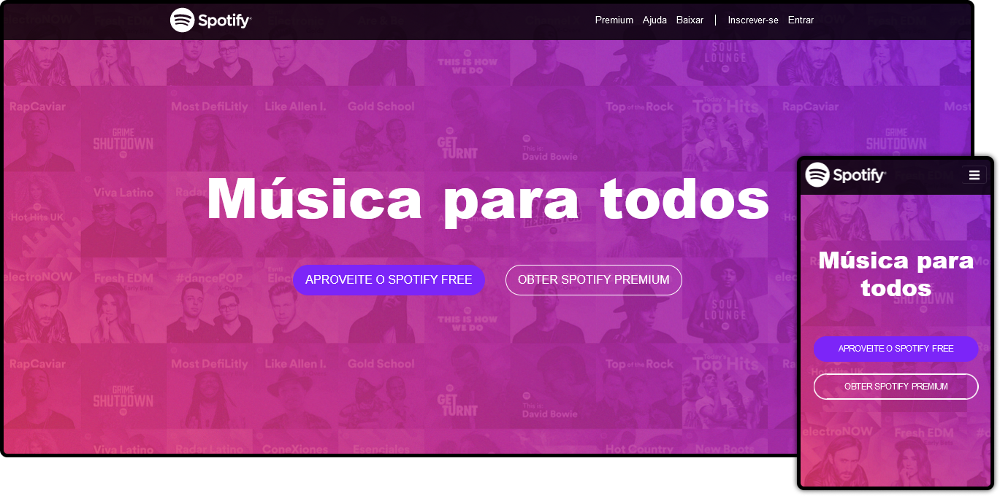

<h1 align="center">
    
</h1>

 

  

## 🚀 Tecnologias

Esse projeto foi desenvolvido com as seguintes tecnologias:

- HTML5
- CSS3
- Bootstrap

## 💻 Projeto

Esse é um clone da Landing-page de uma versão do Spotify. Feita no intuito de práticar Bootstrap.

## 🔖 Layout

Referencia: Spotify.

## Licença

Esse projeto está sob a licença MIT. Veja o arquivo [LICENSE](LICENSE.md) para mais detalhes.

